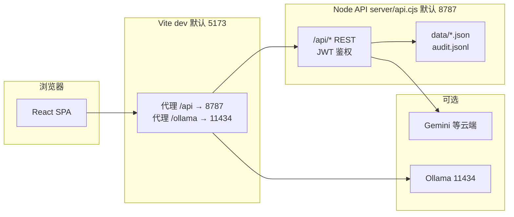

# AI Guardian（安全 AI 守望者）— 项目说明与运行指南

本文档汇总本仓库的技术栈、应用逻辑、**当前推荐运行架构**，以及在新环境部署、**保存代码**的常规做法。

---

## 1. 项目概述

面向企业安全合规场景的 Web 应用：支持**合规标准与条款**维护、**评估任务**与**证据驱动的 AI 差距分析**、**仪表盘**、**AI 助手**、**系统设置**（用户/权限、模型配置、审计日志等）。  

前端为 **React SPA**；业务与持久化依赖 **本地 Node API**（Express），数据落在仓库下的 `data/` 目录（JSON / JSONL）。

---

## 2. 技术栈

| 层级 | 技术 |
|------|------|
| 语言 | **TypeScript**（前端）、**JavaScript**（`server/api.cjs` CommonJS） |
| 前端框架 | **React 19** + **React DOM** |
| 构建 / 开发服务器 | **Vite 6**（`@vitejs/plugin-react`） |
| 样式 | **Tailwind CSS 4**（`@tailwindcss/vite`） |
| 动效 / 图表 | **motion**、**recharts** |
| 图标 | **lucide-react** |
| 表格与导出 | **xlsx**；**docx**、**jspdf** 用于 Word/PDF 导出 |
| AI 相关 | **@google/genai**（Gemini）；Ollama / OpenAI 兼容接口经自建代理或直连配置（见 `src/services/llm.ts`） |
| 后端运行时 | **Node.js** + **Express 4**（`server/api.cjs`） |
| 配置加载 | **dotenv**（`.env.local`、`.env`） |

类型检查：`npm run lint` → `tsc --noEmit`（**无单独 ESLint 配置**，以 TypeScript 为准）。

---

## 3. 当前运行架构（开发 / 典型本地）

整体为 **浏览器 → Vite 开发服务器 → 反向代理 → 本地 API → 文件型数据存储**。



要点：

- **前端**：`npm run dev` 启动 Vite（默认 **5173**，`package.json` 中可为 `5173`，`strictPort: false` 时端口被占用会自动换端口，以终端输出为准）。
- **API**：`node server/api.cjs` 监听 **8787**（可用 `API_PORT` 修改）。
- **代理**：`vite.config.ts` 将 **`/api`** 转到 `http://127.0.0.1:8787`，**`/ollama`** 转到本机 Ollama，避免浏览器跨域。
- **自动起 API**：仅 `vite` 且未设置 `AI_GUARDIAN_SKIP_API=1` 时，Vite 插件会尝试在 **8787** 拉起 `server/api.cjs`；若端口已被占用，需自行处理或改 `API_PORT`。
- **`npm run dev:all`**：同时起 API + Vite，并为 Vite 设置 `AI_GUARDIAN_SKIP_API=1` 避免重复启动 API。

生产形态可参考 `server/api.cjs` 注释：**`SERVE_DIST=1`** 时由同一进程托管构建后的 `dist/`（适合单机或容器一体化部署）。

---

## 4. 逻辑架构（应用层）

### 4.1 前端路由与权限

- 入口：`src/App.tsx`。  
- 按登录态展示 **Login** 或主导航（仪表盘 / AI 助手 / 评估任务 / 合规标准 / 配置）。  
- 权限矩阵来自服务端 `settings.permissions` 与角色合并（`src/permissions.ts`），控制 Tab 可见与敏感操作。

### 4.2 主要功能模块

| 模块 | 路径 / 说明 |
|------|----------------|
| 仪表盘 | `src/components/Dashboard.tsx` |
| 评估流程 | `src/components/AssessmentFlow.tsx`（懒加载）：证据 → AI 逐条差距分析 → 报告导出 |
| 标准与条款 | `src/components/StandardsConfig.tsx`（懒加载）：标准目录、控制项、导入 JSON/Markdown/Excel |
| 系统设置 | `src/components/SystemSettings.tsx`（懒加载）：用户、模型、同步策略、审计等 |
| AI 助手 | `src/components/AiAssistant.tsx`（懒加载） |
| AI 调用 | `src/services/llm.ts`：`performGapAnalysis`、证据节选、与服务端模型快照合并等 |

### 4.3 数据流概要

- **认证**：JWT 存 `sessionStorage`，请求头 `Authorization: Bearer …` 访问 `/api/*`。  
- **设置 / 用户 / 审计**：经 `src/services/settingsApi.ts`、`authApi.ts` 访问 Express。  
- **评估列表**：与 `data/assessments.json` 等同步（具体以 `settingsApi` 与 `App` 中逻辑为准）。  
- **模型配置**：系统设置写入服务端后，`App` 将 `settings.model` 同步到 `llm` 层运行时快照，与 `localStorage` 合并供差距分析使用。

---

## 5. 仓库目录（精简）

```
├── src/                 # 前端源码（React + TS）
│   ├── App.tsx          # 根布局、导航、评估与深度评估编排
│   ├── components/      # 页面级组件
│   ├── services/        # API 封装、LLM、导出等
│   ├── utils/           # 证据节选、标准导入等工具
│   └── types.ts         # 核心类型
├── server/
│   └── api.cjs          # Express API、数据文件读写
├── scripts/
│   └── dev-all.cjs      # API + Vite 一键开发
├── data/                # 运行时数据（默认路径，可配 DATA_DIR）
├── dist/                # npm run build 产出（生产静态资源）
├── vite.config.ts
├── package.json
└── docs/
    └── PROJECT_GUIDE.md # 本文件
```

---

## 6. 本地开发：命令与环境

### 6.1 安装依赖

```bash
npm install
```

需 **Node.js**（建议 **20 LTS** 或与团队一致的当前 LTS），npm 随发行版即可。

### 6.2 环境变量（常用）

在项目根目录创建 **`.env.local`**（或 `.env`），`server/api.cjs` 与 Vite 会加载：

| 变量 | 说明 |
|------|------|
| `JWT_SECRET` | 生产务必改为强随机字符串 |
| `API_PORT` / `API_HOST` | API 监听，默认 `8787` / `127.0.0.1` |
| `DATA_DIR` | 数据目录，默认仓库下 `data/` |
| `GEMINI_API_KEY` | 可选；也可在系统设置 UI 中配置云端模型 Key |
| `SERVE_DIST` | `1` 时 API 进程同时托管前端 `dist/` |
| `OLLAMA_PROXY_TARGET` | Docker 等场景下 Ollama 地址，如 `http://host.docker.internal:11434` |

前端还可通过 Vite 的 `define` 使用部分 `GEMINI_API_KEY`（见 `vite.config.ts`），**优先以系统设置与服务端持久化为准**。

### 6.3 推荐启动方式

**方式 A（常用）**：只跑 Vite，由插件自动尝试拉起 API（未占用 8787 时）

```bash
npm run dev
```

浏览器访问终端打印的 **Local** 地址（含端口），**不要**直接双击打开 `dist/index.html` 访问 `/api`（会失败）。

**方式 B**：终端 1 起 API，终端 2 起前端（需跳过 Vite 内嵌起 API，避免双开）

```bash
# 终端 1
npm run dev:api

# 终端 2
set AI_GUARDIAN_SKIP_API=1   # Windows cmd
# 或 export AI_GUARDIAN_SKIP_API=1  # macOS/Linux
npm run dev
```

**方式 C**：一键双进程

```bash
npm run dev:all
```

---

## 7. 在新环境运行（从零到可访问）

1. **安装 Git 与 Node.js**（建议 Node 20+）。  
2. **获取代码**：`git clone <仓库 URL> && cd ai-guardian-new`  
3. **安装依赖**：`npm install`  
4. **配置环境**：复制或创建 `.env.local`，至少设置安全的 `JWT_SECRET`；按需配置 `GEMINI_API_KEY` 或后续在 UI 中配置模型。  
5. **启动**：`npm run dev` 或 `npm run dev:all`。  
6. **首次访问**：若系统无用户，按界面完成 **Bootstrap** 创建管理员。  
7. **数据目录**：首次运行后检查 `data/` 是否生成 `settings.json`、`users.json` 等；备份即备份该目录（或使用 `DATA_DIR` 指向挂载卷）。

**仅预览构建结果（仍需 API）**：

```bash
npm run build
# 需 API 在 8787 运行，例如另开终端: npm run dev:api
AI_GUARDIAN_SKIP_API=1 npm run preview
```

`vite preview` 的代理配置与 `vite.config.ts` 中 `preview.proxy` 一致。

---

## 8. 代码保存与协作（Git）

### 8.1 日常保存到本地仓库

```bash
git status                          # 查看变更
git add <文件或目录>                 # 暂存
git commit -m "简要说明本次修改"    # 提交到本地
```

建议 **commit 信息用完整句**、说明「改了什么、为什么」，便于回溯。

### 8.2 同步到远程（GitHub / GitLab 等）

```bash
git remote -v                       # 确认远程名，一般为 origin
git push origin <当前分支名>
```

若远程为新仓库：

```bash
git remote add origin <远程仓库 HTTPS 或 SSH URL>
git push -u origin main
```

（默认分支名可能是 `main` 或 `master`，以实际为准。）

### 8.3 换电脑继续开发

```bash
git clone <仓库 URL>
cd ai-guardian-new
npm install
# 复制旧机器上的 .env.local / data/（若需延续环境与用户数据）
npm run dev
```

**注意**：`node_modules/` 与 `dist/` 通常不提交；个人敏感配置不要提交到公开仓库（将 `.env.local` 加入 `.gitignore` 若尚未忽略）。

---

## 9. 构建与质量检查

```bash
npm run lint    # TypeScript 类型检查（tsc --noEmit）
npm run build   # 生产构建 → dist/
npm run clean   # 删除 dist/
```

CI 中可只跑 `npm run lint && npm run build`。

---

## 10. 常见问题

| 现象 | 可能原因与处理 |
|------|----------------|
| 页面提示无法访问 `/api` | 未启动 `server/api.cjs` 或 8787 被占用；确认 `npm run dev:api` 或 Vite 插件日志 |
| 登录后模型行为与设置不一致 | 确认已从服务端拉取 settings；保存设置后依赖 `refreshSettingsForPerm` 或重新登录 |
| Ollama 连不上 | 开发环境走 `/ollama` 代理；Docker 中设置 `OLLAMA_PROXY_TARGET` |
| 类型报错 | 运行 `npm run lint`，按 TS 提示修复 |

---

## 11. 文档维护

本文件路径：**`docs/PROJECT_GUIDE.md`**。  

若架构或脚本有变更（端口、环境变量、新脚本），请同步更新本节与 `package.json` 保持一致。

---

*文档生成基于当前仓库结构；具体行为以源码与 `package.json` 为准。*
